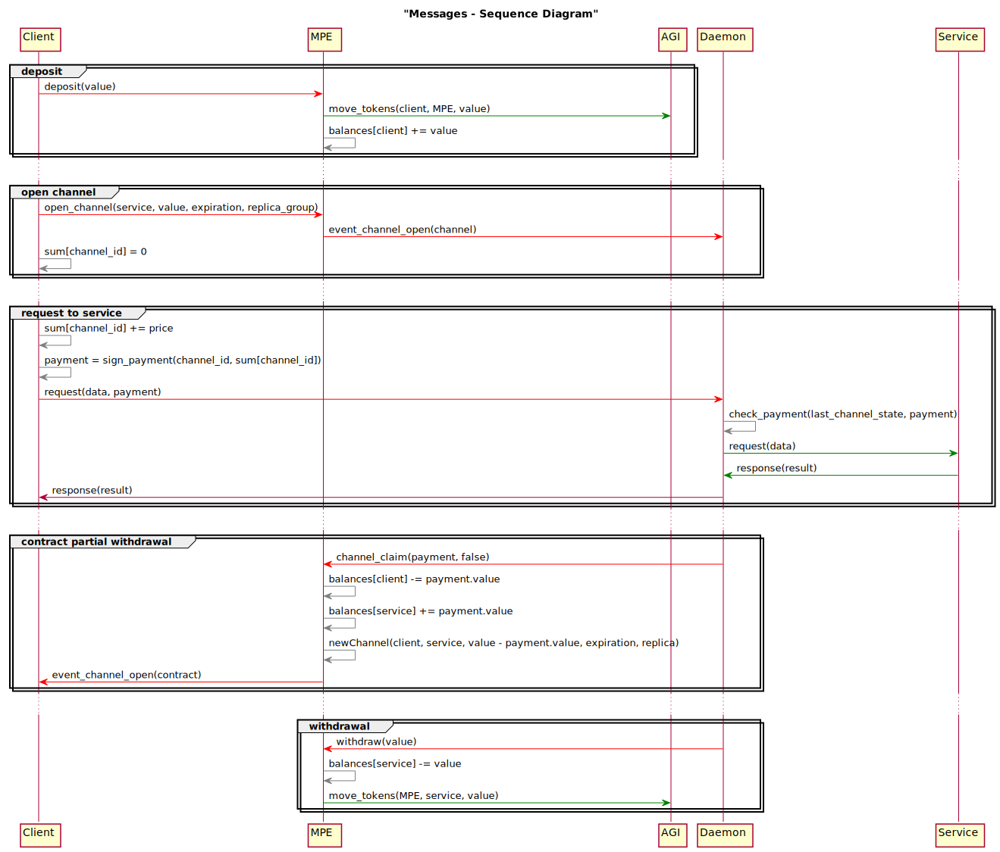

----

原文链接：https://dev.singularitynet.io/docs/concepts/daemon-api/

译者：BING

时间：20190527

----

`snetd`, SingularityNET后端守护进程，提供了使用多方托管合约支付通道来调用服务方法的API。

为了调用已经发布的服务的方法，客户端会将支付的细节通过gRPC元数据发送出去，正如同下面 [gRPC元数据](https://dev.singularitynet.io/docs/concepts/daemon-api/#grpc-metadata)部分提到的一样。服务端会在响应中返回[gRPC错误编码](https://dev.singularitynet.io/docs/concepts/daemon-api/#grpc-error-codes) 。

有两种情形下，客户端想要知道与服务相关的支付通道的状态：

- 响应中不正确的随机数
- 第一次开始与服务交互

支付通道的状态可以通过[支付通道API](https://dev.singularitynet.io/docs/concepts/daemon-api/#payment-channel-state-api)来获取。

一系列的经典的C/S交互可以在下面[调用序列](https://dev.singularitynet.io/docs/concepts/daemon-api/#sequence-of-calls)部分看到。

## gRPC元数据

**发起请求时，为了将支付数据传递到服务端，客户端需要填写下面的`gRPC`元数据字段：**

- `snet-payment-type` - 支付协议类型，当前托管是唯一支持的值，就是说使用多方托管合约来进行支付。
- `snet-payment-channel-id` - 在多方托管合约中的支付通道`id` ([十进制数字字符串](https://dev.singularitynet.io/docs/concepts/daemon-api/#using-decimal-numbers))
- `snet-payment-channel-nonce` -支付通道的随机数([十进制数字字符串](https://dev.singularitynet.io/docs/concepts/daemon-api/#using-decimal-numbers))
- `snet-payment-channel-amount` - 客户端签名验证的数额([十进制数字字符串](https://dev.singularitynet.io/docs/concepts/daemon-api/#using-decimal-numbers))
- `snet-payment-channel-signature-bin` - 客户端支付签名([65字节base64编码](https://dev.singularitynet.io/docs/concepts/daemon-api/#binary-data-encoding))

### 使用十进制数字

一些值表示十进制数字但打印出来是字符串。原因在于它们的本质，这些值本身表示递增的计数值。将它们表示为16进制的字符串，`uint256`类型的数字，需要发送64字节的数字，即使是很小的值。为了更紧凑和清晰地表示这些值，我们决定保留为字符串格式但是是10进制含义的值。客户端应当期待这个值是`uint256`类型，因此代码中表示这些值的最好的类型是`BigInteger`。

### 二进制数据编码

**gRPC支持在元数据中发送二进制数据**。为了使用这个特性，元数据键应当有`-bin`后缀。调用者应当能为这些键传送强制转换为字符串的字节数组（有些实现肯呢个允许传送字节数组而无需强制转换）。gRPC库使用`base64`编码编码这些值。 [点击查看gRPC文档是如何说的](https://github.com/grpc/grpc-go/blob/master/Documentation/grpc-metadata.md#storing-binary-data-in-metadata)。

## gRPC错误编码

当错误发生时，SingularityNET守护进程使用标准和定制的gRPC错误码来为客户端提供信息。服务本身返回的错，会直接传送给客户端，而无需任何转换。

**gRPC错误编码**：

- `Unauthenticated` - 支付信息不正确；
- `IncorrectNonce` (自定义编码1000) - 支付的随机值不正确，可能的原因是服务提供者声明取回了通道里的钱并开启了新的通道，当前通道被关闭；
- `FailedPrecondition` - 调用无法完成，因为另一个调用正在进行中，或者频率限制被启用；
- `InvalidArgument` - 支付信息格式不正确；
- `Internal` - 未知错误，守护进程状态不正确或者子系统不可用，服务提供者需要解决这个问题。

完整的期待的错误信息如下：

- `Unauthenticated`:
  - "支付签名不正确"
  - "支付未被通道发起者签名"
  - "支付通道即将关闭，关闭时间为： %v, current bloc当前区块k: %v, 到期阈值: %v"
  - "通道内没有足够的代币，通道内数量%v, 支付数额 %v"
  - "支付通道"%v" 未发现"
  - "收入%d与价格不相等%d"

- `IncorrectNonce`:
  - "通道随机值不对，最新值：%v，发送值：%v"
- `FailedPrecondition`:
  - “another transaction on channel: %v is in progress”
  - "另一个交易：%v正在通道中"
- `InvalidArgument`
  - "元数据丢失"
  - "不正确的支付类型，值: %v"
  - "不正确的格式%v: %v"
  - "不正确的二进制键名：%v"
  - "缺失%v"
  - "键对应的值太多%v: %v"

## 支付通道状态API

The client can get the latest payment channel state from the service using PaymentChannelStateService via gRPC. See [state_service.proto](https://github.com/singnet/snet-daemon/blob/master/escrow/state_service.proto) for the API description.

客户端能够从服务那里获取到最新的支付通道信息，通过`gRPC`使用`PaymentChannelStateService`，参考[state_service.proto](https://github.com/singnet/snet-daemon/blob/master/escrow/state_service.proto)查看更多描述信息。

```protobuf
//
// FIXME: All changes all this file should manually be copied to the `snet-cli`
// 
// repo until https://github.com/singnet/snet-daemon/issues/99 and
// https://github.com/singnet/snet-cli/issues/88 are fixed.
//

syntax = "proto3";

package escrow;

// PaymentChannelStateService contains methods to get the MultiPartyEscrow
// payment channel state.
// channel_id, channel_nonce, value and amount fields below in fact are
// Solidity uint256 values. Which are big-endian integers, see
// https://github.com/ethereum/wiki/wiki/Ethereum-Contract-ABI#formal-specification-of-the-encoding
// These values may be or may be not padded by zeros, service supports both
// options.
service PaymentChannelStateService {
    // GetChannelState method returns a channel state by channel id.
    rpc GetChannelState(ChannelStateRequest) returns (ChannelStateReply) {}
}

// ChanelStateRequest is a request for channel state.
message ChannelStateRequest {
    // channel_id contains id of the channel which state is requested.
    bytes channel_id = 1;
    // signature is a client signature of the message which contains
    // channel_id. It is used for client authorization.
    bytes signature = 2;
}

// ChannelStateReply message contains a latest channel state. current_nonce and
// current_value fields can be different from ones stored in the blockchain if
// server started withdrawing funds froms channel but transaction is still not
// finished.
message ChannelStateReply {
    // current_nonce is a latest nonce of the payment channel.
    bytes current_nonce = 1;

    // current_signed_amount is a last amount which were signed by client with current_nonce
    //it could be absent if none message was signed with current_nonce
    bytes current_signed_amount = 2;

    // current_signature is a last signature sent by client with current_nonce
    // it could be abset if none message was signed with current nonce
    bytes current_signature = 3;
 }
```


## 调用序列

客户端和守护进程之间的交互调用描述：




END.