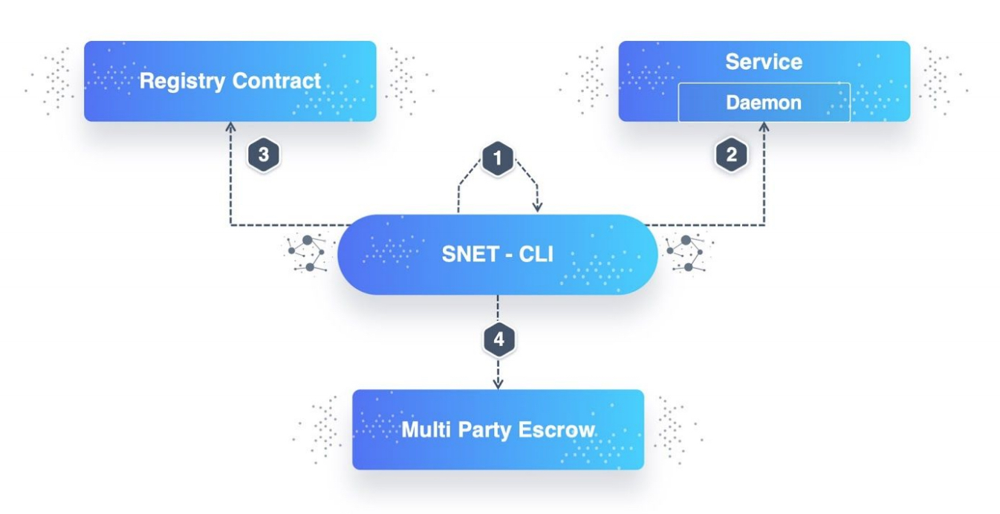

----

原文链接：https://dev.singularitynet.io/docs/concepts/snet-cli/

译者：BING

时间：20190528

----

SingularityNET命令行界面（CLI）是和平台的智能合约交互、管理部署的服务、管理资金的主要工具。它针对的是服务提供者开发。未来会实现基于Web的后台以及控制面板。

CLI提供命令和区块链交互的方式有：

- 创建和管理身份；
- 注册和管理在SingularityNET注册合约中的组织，成员，服务，类型以及标签等；
- 使用MPE合约和支付通道从用户那里取回资金（用户消费了服务）；
- 读写关于AI服务的元数据以及Protobuf的描述(这些存储在IPFS，而基础的服务参数可以从区块链上的智能合约中取得)，并且：
- 连接到不同的网络，如本地测试网，Kovan，Ropsten以及以太坊主网等。

CLI同时也提供服务开发和部署支持。能通过生成服务元数据、Protobuf描述以及由SingularityNET基金会提供的代码模板来设置新服务。CLI会为每个服务和后端交互。安全角度说，CLI遵循由以太坊提供的用于存储私钥的指引。当用户身份通过客户端创建、注册完毕后，CLI会安全地将这些细节存储到本地机器，且只在需要与区块链交互时才获取这些数据。



CLI要求连接到四个主要部件：

- 用户身份管理。牵涉到用户注册，管理身份和会话，锁定/解锁在区块链上的交易账户。CLI运行时这个组件是在本地机器上的。
- sidecar代理。与运行AI服务的服务器通信。
- 注册中心合约。需要处理组织，成员，服务，类型以及标签等内容。
- MPE合约。发送、接收资金，并负责管理与支付通道相关的函数。如，关闭通道，扩展通道过期时间。

这个工具在我们的教程和指导手册中广泛应用，可以看这个[指导](https://dev.singularitynet.io/docs/setup/requirements)来安装。参考[CLI文档](http://snet-cli-docs.singularitynet.io/)了解全部细节。

## 向服务SingularityNET发起调用

### JSON参数

当用protocol buffers通信时，命令行中调用参数会表示为JSON格式。

有三种方式传递JSON数据：

-  命令行参数
-  JSON文件
- 标准输入

比如，在 [这个案例](https://dev.singularitynet.io/docs/development/mpe-example#make-a-call-using-stateless-logic)中我们需要传递下面的JSON内容作为参数，用于调用服务中的`add`函数：

```json
{"a": 10, "b": 32}
```

我们可以用三种方式：

```bash
# 命令行参数
snet client call 0 0.1 localhost:8080 add '{"a":10,"b":32}'

# JSON文件
echo '{"a":10,"b":32}' > p.txt
snet client call 0 0.1 localhost:8080 add p.txt

# 标准输入
echo '{"a":10,"b":32}' | snet client call 0 0.1 localhost:8080 add
```

### 修改器

我们已经为JSON实参数现了好几个修改器，为了简化传递大文件以及可以传递二进制数据(不仅是base64编码数据)。

三种可能的修改器：

- 文件 - 从文件读取
- b64encode - 编码为base64
-  b64decode - 从base64解码

比如，如果想传送下面的JSON数据作为参数，我们将用base64编码图片。

```bash
'{"image_type": "jpg", "file@b64encode@image": "1.jpeg"}'
```

如果我们从上面的例子中移除b64修改器，我们将传递二进制格式的图片，并且没有base64编码。

END.