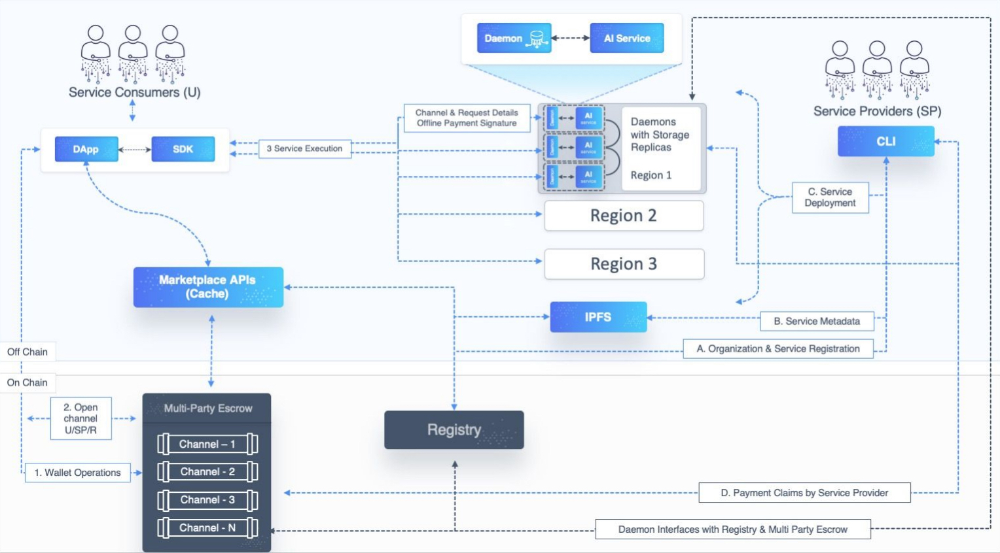

-----

译者：BING
时间：20190524

原文地址：<https://dev.singularitynet.io/docs/concepts/>

----

> 关于SingularityNET的基本概念和组件构成。

### 概览

SingularityNET (SNET) 是一个**开源**的、**去中心化**的AI服务网络，其中AI服务通过区块链来使用。开发者们可以将他们的服务发布到Singularity网络，这些服务可以被世界上任何地方的人使用，只需要联网即可。开发者可以使用代币AGI来为他们的服务收费。

服务包含与人工智能和机器学习相关的所有的方方面面。服务可以提供推断或者模型训练服务，包含图像/视频，语音，文本，时间序列，生物AI，网络分析等等。

服务可以很简单，如封装一下经典的路径规划算法`A*`算法，提供一个完整的端到端的工业问题的解决方案，或者一个独立的AI应用等等。开发者也可以在网络上部署自动AI智能体，用来与网络上的其他服务进行交互。

SingularityNET平台包含许多重要的组件，这些组件联合起来才能使得一个去中心化的AI服务网络繁荣起来。 这些核心组件旨在实现一个具有功能性，可伸缩性以及可扩展性的系统。

在几个关键的决策和一个目标的指引下，我们通过非常小心谨慎的过程实现了当前的系统架构。这些决策包括区块链交互，AI服务。目标是构建一个AI市场，这个市场要开放且满足监管要求、符合法律法规。

第一，我们做了一些选择来最小化我们对当前使用的以太坊区块链的依赖。从概念和实际问题出发，我们做的这些决定都是有必要的。从概念上说，我们希望将区块链进一步抽象，使其不被感知。如果必要的话，我们将基于声誉构建自己的共识算法。以太坊区块链的交互速度、可靠性以及成本都意味着：任何构建在它之上的可伸缩的系统都需要考虑最小化费用成本和减少由挖矿出块导致的延迟时间。我们做的选择反映在我们提供的工具包（后端，命令行和SDK）的使用上，在使用多方托管合约和原子性的单向支付通道时，对区块链交互进行了抽象。

第二，对于AI服务整合，为了降低学习曲线，最小化通过网络提供AI服务的难度， 我们试图尽可能多的对网络进行了抽象。这种抽象的实现方式是使用一个单独且灵活的工具：后端守护进程。这个守护进程能帮助我们向社区提供可伸缩性、健壮性、分布性以及管理等特性。

最后，为了让**AI服务市场**满足监管且不损伤开放性，我们将其与区块链上现有的完全去中心化的AI服务注册分开实现。

### 概念和组件

现在我们将把SingularityNET平台和网络分成多个核心组件分别了解。下面这个图描述了系统的核心组件以及辅助组件和各自的功能角色。

你可以直接进入到你想了解的模块，或者按照导航按顺序阅读。

- [**SingularityNET市场**](https://dev.singularitynet.io/docs/concepts/marketplace) -  SingularityNET市场是一个DApp(去中心化应用) ，并且提供一个前端来帮助探索已经注册在链上的AI服务。用户可以在网页上与AI服务交互，使用完成后为服务打分。这样社区能够提供使用服务的反馈，并了解这些服务的预期质量，这些数据都将进入到声誉系统引擎。
- [**Service**](https://dev.singularitynet.io/docs/concepts/service) 服务是发布到SingularityNET网络之上，并提供一个基于[grpc](https://grpc.io/)API调用。这些服务API的说明、能够访问服务的IP地址以及定价信息将发布到IPFS作为服务的**元数据**。**元数据的地址**会在SingularityNet注册中心公布。
  - [服务元数据](https://dev.singularitynet.io/docs/concepts/service-metadata) - 元数据用来描述服务的API，支付方法以及哪里去发现这个**服务的地址**。
  - [命名标准](https://dev.singularitynet.io/docs/concepts/naming-standards) - 我们会要求用户遵循一定的指引来命名服务。
- [**软件**](https://dev.singularitynet.io/docs/concepts/software)
  - [**snet-cli**](https://dev.singularitynet.io/docs/concepts/snet-cli) -  `snet`命令行工具可以用来与平台进行交互：无论是调用查询服务还是发布自己的服务，都可以用这个命令。它可以完成许多重要的任务，如注册和管理身份，发布服务，更新注册信息，通过平台新的访问端点，管理支付通道和余额，调用服务等等。

  - [**SDK**](https://dev.singularitynet.io/docs/concepts/sdk) - 软件开发包SDK将帮助我们整合SingularityNET服务到我们自己的软件中

  - [**SNET守护进程**](https://dev.singularitynet.io/docs/concepts/daemon) - 开发者是通过运行`SNET`守护进程来对外暴露他们的服务到网络上。守护进程将与区块链交互，并完成验证，支付，并且作为向服务发起API调用的通道。这隔离了支付与区块链交互，如此一来，开发者只需要关注部署和提升他们的服务即可。
    - [守护进程API](https://dev.singularitynet.io/docs/concepts/daemon-api)
    - [守护进程通道存储](https://dev.singularitynet.io/docs/concepts/daemon-channel-storage)
- [**区块链智能合约**](https://dev.singularitynet.io/docs/concepts/blockchain-contracts)
  - [**AGI代币**](https://dev.singularitynet.io/docs/concepts/agi-token) - 使用AI服务的代币，基于ERC20标准发行的，运行在以太坊上。

  - [**注册合约**](https://dev.singularitynet.io/docs/concepts/registry) - 服务会发布到位于区块链上注册中心，注册中心全网公开可访问。注册中心维护了一个可用的服务列表和哪里去寻找服务相关的元数据。注册中心支持按照组织或团队的形式为服务分组，且可设定服务的访问权限。

  - [**托管合约**](https://dev.singularitynet.io/docs/concepts/multi-party-escrow) - 链上的托管合约会在终端用户和服务进行交互期间持有AGI代币，终端用户会在调用服务之前把AGI代币存到托管合约，AGI代币会一直存在托管合约中，直到服务完成或者托管合约到期。
    - [MPE无状态的客户端](https://dev.singularitynet.io/docs/concepts/mpe-stateless-client)
- **The Request for AI Portal (RFAI):AI入口请求**：这是一个DApp，在这里终端用户和应用开发者能够请求特定的AI服务（他们想加进网络的服务），并抵押一定的代币作为奖励以获得高质量的解决方案。