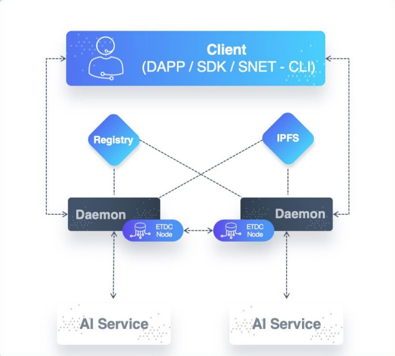

----

译者：BING

时间：20190524

原文链接：<https://dev.singularitynet.io/docs/concepts/daemon/>

---

> 学习守护进程相关内容，它是如何与SingularityNET市场和以太坊进行交互的。

[SingularityNET守护进程](https://github.com/singnet/snet-daemon)是一个适配器，服务可以通过它来与SingularityNET平台交互。

在软件架构的语境下，守护进程(Daemon)是一个[sidecar代理](https://docs.microsoft.com/en-us/azure/architecture/patterns/sidecar)(参考sidecar模式) -- 一个部署在核心应用周围的进程（在本文的案例中，AI服务是核心应用），该进程会用来对架构进行抽象，比如日志和配置；也会用来对整个平台进行一定的抽象，如和智能合约的交互，甚至是否使用以太坊区块链的决策也可以抽象出来。Daemon的两个核心抽象任务是支付和对请求的翻译。为了准许支付，Dameon会与多方托管智能合约进行交互。在通过SingularityNET调用服务之前，用户必须：

1. 向多方托管合约中存一定的代币，
2. 和服务定义中指定的接受者开启一个支付通道，
3. 每次调用服务Daemon都会检查签名是否为真，
4. 支付通道内是否有足够的代币，
5. 支付通道的终止时间在特定的阈值之上，以确保开发者（服务提供者）能够取回用户消费的代币

在这些检查完成后，请求会发送到服务。Daemon也会跟踪不同客户端的支付状态。

一旦Daemon完成了请求的验证，它会将请求翻译为AI服务需要的数据格式。 Daemon会暴露一个`gRPC`接口，所有的请求都基于`gRPC`和`protocol buffers`，但是Daemon能将请求翻译为AI服务需要的其他的格式：除了gRPC/Protobuf， 如JSON-RPC等。(注：process fork–based services不是很了解，后续再更新。 )这种翻译使得网络可以采用一种连贯的协议在服务间进行通信。守护进程Daemon和命令行也用`gRPC`和`Protobuf`通信。开发者可以部署多个AI服务的实例，每个实例有它自己的守护进程Daemon，并且所有的守护进程都会在注册中心上注册为访问端点。当多个实例并存时，它们可以被放进一个或多个实例组内（这么做的原因是可以将实例分组到同一个数据中心或者云端上的相同区域）。同一组内的守护进程可以通过[etcd](https://coreos.com/etcd/).共享支付状态。守护进程还提供了一些额外的**部署**相关和面向**管理**的特性：

- SSL终端。这可以由服务开发者提供证书和秘钥来实现，或者由 [Let’s Encrypt](https://letsencrypt.org/)提供服务。
- 日志，使用日志滚动以及可插拔日志钩子。当前邮件钩子已经提供了，其他的钩子也可以通过易用的API实现。
- 性能度量，监控，警报。守护进程收集了关于请求调用的度量指标，服务的拥有者可以用来优化资源使用。它同时也监控着守护进程和服务事件，通过邮件或者网站服务来提供可配置的警报通知。
- 使用频率限制，以防止DoS(解决服务攻击)，并且允许服务所有者按照他们自己的步伐(速度、能力)来扩展，守护进程使用的是[token bucket](https://en.wikipedia.org/wiki/Token_bucket) 算法。
- 心跳服务。守护进程也提供基于拉取的心跳服务，遵循[gRPC健康检查协议](https://github.com/grpc/grpc/blob/master/doc/health-checking.md)。守护进程会检查服务的心跳是否已经配置，这个服务会用来监控服务和市场。

最新版本的服务，可以在这个页面[下载](https://github.com/singnet/snet-daemon/releases)。

### 支持的服务类型

守护进程已经可以支持多种实现，当前的守护进程支持的服务包含：

- 暴露`gRPC`端点
- 暴露`JSON-RPC`端点
- 基于每次请求的可执行调用，数据通过标准输入`stdin`传入

不管哪种类型的服务是如何与后端守护进程组合在一起的，要关注的是后端守护进程是如何暴露gRPC/gRPC-Web端点对外提供服务的。

这意味着我们有一个统一的协议，可以用于和网络上的任意的协议通信。同时还允许服务的作者在实现服务时有一定的灵活性。特定的gRPC特性，比如流，就需要服务本身对外暴露的gRPC端点支持流式RPC(流也是本平台在进展中的，[阅读更多](https://github.com/singnet/snet-daemon/issues/195))。同时需要注意，双向流式RPC只支持部分客户端，不支持gRPC-Web，如浏览器。

### 服务模型

正如在讨论[服务](https://dev.singularitynet.io/docs/concepts/service)时提到的，服务API是使用[protobuf](https://developers.google.com/protocol-buffers/docs/reference/proto3-spec#service_definition)来定义的。

### SSL

守护进程支持SSL终端，可以由服务开发者提供证书和秘钥来实现。可以参考由 [SSL手册](https://dev.singularitynet.io/tutorials/daemon-ssl-setup)跟随一步一步操作来使用 [Let’s Encrypt](https://letsencrypt.org/)的服务。

### 验证与支付

在通过SingularityNET平台调用服务之前，用户必须先：

- 向[多方托管合约](https://dev.singularitynet.io/docs/concepts/multi-party-escrow)存一定的代币，然后，
- 与接受者开启一个支付通道，接受者由[服务的元数据](https://dev.singularitynet.io/docs/concepts/service-metadata))进行指定

每次调用，守护进程都会检查：

- 签名是否合法
- 支付通道是否有足够的代币
- 支付通道的过期时间是否大于一个指定的阈值(以确保服务的作者能够拿回用户使用服务付出的代币)

在这些检查通过后，请求会发送到服务这里来。

### 配置

与[服务类型](https://dev.singularitynet.io/docs/concepts/daemon/#supported-service-types))，[SSL](https://dev.singularitynet.io/docs/concepts/daemon/#ssl)，区块链交互等相关的守护进程的行为，能够通过配置文件、环境变量以及可执行的标志来控制。参看 [守护进程描述文档](https://github.com/singnet/snet-daemon#configuration)了解可用的配置键，以及它们是如何映射到环境变量和运行时标志的。

### 支付通道的状态

守护进程在`etcddb`集群中存储了支付通道的状态。这个集群可以集成在`etcd`实例中，其中`etcd`实例运行时会与每个`snetd`进行通信；或者是外部的配置集群，具体细节参考[这里](https://dev.singularitynet.io/docs/concepts/daemon-channel-storage)。

END.

