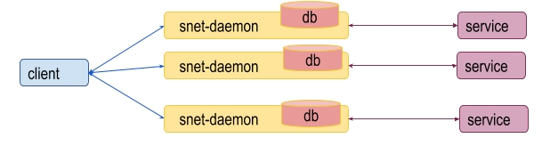
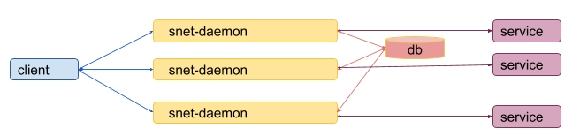
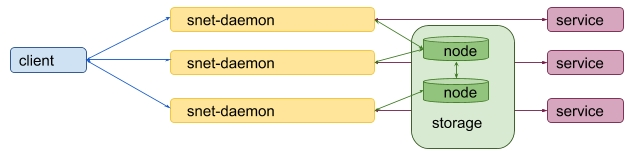
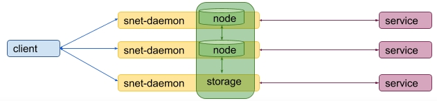
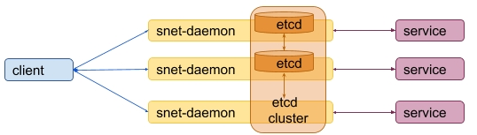

----

译者：BING

原文链接：https://dev.singularitynet.io/docs/concepts/daemon-channel-storage/

时间：20190527

----

为了完成客户端调用服务的请求，守护进程`snet-daemon`需要存储并处理关于服务支付的信息。二者之间的连接称之为支付通道。

如果只有一个服务和一个对应的守护进程，处理过程就很容易：


当支付传递一个验证过程到守护进程，支付通道会被存储在内部存储中，并且将在服务完成后可被取回。

如果服务提供了多个节点，情况就会变得复杂。不可能为每个后端守护进程提供独立的内部存储。



每个节点使用独立的支付通道有一个缺点是，费用会很贵，因为每打开一个支付通道都需要在链上处理。

另一个缺点是，模型会被攻击。同样一个支付通道能在多个节点上调用服务。因**此同样的服务在所有的节点上需要共享存储。**



但是，只提供一个存储，会导致系统单点故障，即存储坏了，整个系统都不能使用，即使还有活跃的节点。

因此，我们需要用分布式存储。有很多可用的存储，我们只需要选择最优的方案。我们倾向于下面几个判断标准：

根据[CAP原理](https://en.wikipedia.org/wiki/CAP_theorem)，我们只能选择三个中的两个（三者不可能同时满足）：

- 分区容忍性
- 可用性
- 一致性

我们需要一个分区容忍的分布式系统来防止网络失败。更进一步，我们需要存储提供强一致性保证，以避免一次支付在不同节点上多次使用。

这并不表示可用性不重要，虽然有一些节点不可用时，将不能读写请求。这是我们需要为存储系统的强一致性付出的代价。

我们将去掉可用性，只保证分区容忍性和一致性：

- 分区容忍性
- ~~可用性~~
- 一致性

新的设计如下：



这个方法是不错的，但是需要服务提供者不仅要为每个节点设置后端守护进程，而且还要部署独立的分布式存储。这会是繁琐又复杂的任务。

为了避免这个问题，将分布式存储整合到守护进程中，运行必要的分布式存储节点就是守护进程的任务了。




### 备选存储方案

我们寻求有强一致性保证的存储方案，将由守护进程运行(比如在GO程序中很容易保证)。

Some of the storages that were considered are:

可选的存储方案有：

| 分布式存储                             | 语言 | CONSENSUS | 嵌入式服务支持                               |
| ------------------------------------------------ | -------- | --------- | ------------------------------------------------------------ |
| [Etcd](https://github.com/etcd-io/etcd)          | Go       | Raft      | [native](https://godoc.org/github.com/coreos/etcd/embed)     |
| [Consul](https://github.com/hashicorp/consul)    | Go       | Raft      | [ticket 467](https://github.com/hashicorp/consul/issues/467) |
| [ZooKeeper](https://github.com/apache/zookeeper) | Java     | ZAB       | [native](https://zookeeper.apache.org/doc/r3.4.6/api/org/apache/zookeeper/server/ZooKeeperServerMain.html) |

选择`Etcd`是因为它由GO语言实现，并且有很好的嵌入式服务支持。也就是说，它的节点可以被`snet-daemon`节点开启和结束。

还不清楚的是能否从GO应用中运行`Consul`服务。

`Zookeeper`由Java实现，从GO语言开启节点需要额外的支持才可以。

**注意**：所有这些存储在`leader`节点选择和值写入时，需要一定的人数间达成共识。如果半数节点失败，则集群就会停止工作。正如前面描述的一样，这是分布式系统为了提供强一致性的代价。

### Etcd存储

#### 运行并访问嵌入式etcd集群

开启一个etcd节点至少需要下面几个参数：

- **name**: 人类可读的名称

- **listen-client-urls**: 用于监听客户流量的URL列表

- **listen-peer-urls**:监听同类节点的URL列表

- **initial-cluster**: 初始集群配置，如：

  ```
  name1=http://AAA.BBB.1.1:2380,name2=http://AAA.BBB.1.2:2380
  ```

- **initial-cluster-token**: 初始化集群令牌：

下面的GO语言代码用来开启`etcd`节点并使用`etcd`客户端：

- [etcd_storage_server.go](https://dev.singularitynet.io/src/etcddb/etcd_storage_server.go)
- [etcd_storage_client.go](https://dev.singularitynet.io/src/etcddb/etcd_storage_client.go)

有一些[吞吐量测试](https://dev.singularitynet.io/src/etcddb)，用于在本地运行几个`etcd`节点，并且衡量读写数量和比较并设置每秒请求数量。

**注意**：因为所有的`etcd`节点是在本地运行，结果可能不同于每个节点在单独的服务器上运行的结果。

### etcd集群大小

根据[etcd FAQ](https://coreos.com/etcd/docs/latest/faq.html)，建议集群中的节点数设置为奇数，通常是3或者5个。在文章"虽然大集群提供了更好的容错性，但是写性能会有影响，因为数据需要在多个机器上进行复制"中也提到了这点。

### 建议的解决方案



下面的解决方案是基于嵌入的`etcd`存储，详情讨论如下：

- 通过命令行创建`etcd`集群
- 固定大小的`etcd`集群
- 渐增的`etcd`集群创建

### 命令行创建`etcd`集群

这个方法是通过在`snet-cli`命令中添加选项，允许我们开启`etcd`实例，将其作为集群的一部分：

> snet storage init –name name –token unique-token –client-url http://AAA.BBB.1.1:2379 –peer-url http://AAA.BBB.1.1:2380 –initial-cluster name1=http://AAA.BBB.1.1:2380,name2=http://AAA.BBB.1.2:2380

客户端URL列表需要传入到每个结点，用于访问`etcd`集群的存储。

### 固定大小的etcd集群

这个方法会假定`etcd`节点由节点自身开启，并且集群大小固定。初始配置文件包含了所有的节点列表和是否开启`etcd`节点的信息：

比如：

| 集群ID    | 开启节点 | 节点名 | 节点客户端URL           | 同类节点URL             |
| --------- | -------- | ------ | ----------------------- | ----------------------- |
| replica 1 | yes      | node1  | http://AAA.BBB.1.1:2379 | http://AAA.BBB.1.1:2380 |
| replica 2 | yes      | node2  | http://AAA.BBB.1.2:2379 | http://AAA.BBB.1.2:2380 |
| replica 3 | no       |        |                         |                         |
| replica 4 | yes      | node3  | http://AAA.BBB.1.4:2379 | http://AAA.BBB.1.4:2380 |
| replica 5 | no       |        |                         |                         |

这样的配置文件要求所有的节点先开启以具有`etcd`集群的功能。

### 渐增式创建etcd集群

开启etcd集群要求集群的初始大小已知。就是说集群能开始工作，当且仅当法定数量的节点加入了集群。

假如有三个集群想运行三个`etcd`节点。当第一个集群开启一个`etcd`节点时，它还不能通过`etcd`读写，因为还有两个`etcd`节点需要加入到集群。

作为备选项，建议第一个集群开启时设定只包含一个节点。此时就可以读写`etcd`节点。当第二个集群开启时，发现已经存在的集群，就可以将第二个节点加入到集群。

这就允许我们拥有一个可以工作的集群，即使是在少部分集群运行的情况下。

注意：`etcd`有一个[发现服务协议](https://coreos.com/etcd/docs/latest/v2/discovery_protocol.html)。它只用于集群启动阶段，不能在运行时重新配置。

下面的算法描述了创建和更新集群的过程，基于渐增式创建的方法。

#### 输入

每个结婚需要能够访问下面的信息，在集群创建阶段：

- etcd集群令牌值
- 所有集群对应的值列表：
  - 集群id
  - 节点名
  - 节点ip地址
  - 节点客户端和同类端口

#### 集群配置表

`etcd`集群维持的表格必须包含下面几列：

- 集群id：
- 时间戳
- 运行etcd服务节点的标志

最后宇哥字段标志着集群开启了`etcd`实例，并且当集群配置表写入后，会一直保持活跃。

#### 集群到节点响应

每个replica都能用预先定义好的返回`etcd`节点数量的函数，对于运行给定数量的活跃的replicas，这个函数是必须的。

函数可以用伪代码描述如下：

```
numberOfEtcdNodes(numberOfReplicas) {
    1, 2   -> 1
    3, 4   -> 3
    5, ... -> 5
}
```

#### 检测增加的和失败的replicas

建议使用心跳机制来检测失败的replicas。每个replica需要重复写时间戳，用replica的id作为键值写到集群配置表。当当前时间和replica的时间戳高于一定的阈值，replica就被认为死掉了。

#### 检测失败节点

`etcd`的管理[API文档](https://coreos.com/etcd/docs/latest/v2/other_apis.html#checking-health-of-an-etcd-member-node))提供了REST风格的API来检查节点的健康状况。

#### 初始状态

第一个初始的replica会检测到当前没有`etcd`集群，并开启一个嵌入式的`etcd`实例。

#### 主循环

每个replica会读取**集群配置表**，检查活跃的replicas的数量，并通过`numberOfEtcdNodes(numberOfReplicas)`函数计算要求的`etcd`节点的数量。

如果要求的`etcd`节点数量少于当前活跃的节点数量，那么只有一个`replica`，还没运行`etcd`节点的`id`最小的replica会将节点加入到集群。

会有两个结果：

- 嵌入的etcd成功运行
- replica开启etcd节点时超时，会被认为已死亡

如果`etcd`节点初始化成功，replica会将记录添加到集群配置表，会让它知道已经运行起来了etcd节点。

两个情景下，进程都会如此重复。

END.