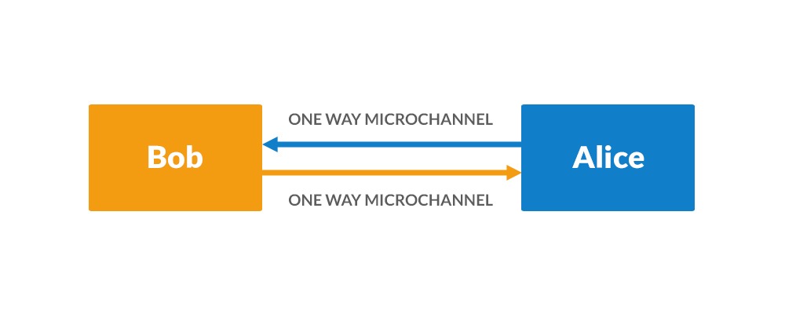

----

译者：BING

原文链接：[http://super3.org/introduction-to-micropayment-channels/](http://super3.org/introduction-to-micropayment-channels/)

时间：20190525

----

### 简介

比特币上的交易严重依赖于交易是否能被打包进入区块并最终成为最长链的组成部分。不幸的是，当前环境下，交易已经多到不能被1MB区块打包（10分钟出一个区块，一个区块大小上限是1MB）。而且，区块的平均产出时间是10分钟，在某些情况下，交易进入到下一个区块可能要超过一个小时。这意味着用户的交易不能按照时序完成，这限制了比特币的使用。

我们需要的是Layer 2的解决方案，以允许用户进行交易而不必直接依赖下一个区块的打包完成。我们提出了使用微型支付通道以允许用户进行交易的模型，在给定的时间内可以进行不限制次数的交易。使用这种方法，只需要开头和结尾均用比特币交易，而中间则不需要，这样也减少了手续费。一旦通道建立，用户就不用担心区块的问题了。

### 一种实现微支付通道的方法

假如Bob想从Alice那里拿到很重要的一份10GB大小的文件，并且他愿意为Alice支付带宽费用。现在Bob并不信任Alice，所以他不会一下就把钱全部给Alice，因为担心Alice会跑路。如果数据定价是每GB需要1mBTC，如果Bob把支付多于10次来支付，就需要多付手续费。而且他也需要等待好几个小时，才能完全确认这些交易被打包进了区块并得到确认。

我们可以在Alice和Bob之间建立一个单项的微支付通道。Bob可以使用这个通道，无论何时他想向Alice支付，只要通道是开着的。Bob想每次支付Alice约10 mBTC。比如Bob将15mBTC发往由Alice和Bob同时控制的钱包。这种钱包需要Alice和Bob都同一所有的交易才能离开。在Bob向钱包存入比特币前，Alice会和Bob签署一个交易，会把钱包中的钱全部返回给Bob，当前这需要设定过一个时间期限用于锁定，比如将来的100个区块。这个锁定期允许我们签署一个正确的交易，但是只能在未来才能消费。可以将这个锁定交易期想象为过期日期。交易是正确的，只是在这个期限到来之前，都不能被消费。这也意味着Alice不能将存入钱包的钱拿走，Bob能在100个区块之后拿回来钱包里的钱。微支付通道能够有效的原因在于如果Alice和Bob都同意，他们可以在通道过期，或者有一方不同意，也或者有一方离线之前做任何的动作。

>  PS. 个人的理解是这样的，Bob作为消费者，先往通道里存入一定的金额，通道中发生的交易需要两个人都签字才有效。Bob可以先签字，发给Alice，Alice就能签上自己的名字取回比特币到自己的钱包。但这个通道建立前，需要设定好一个期限，就是过了一定时间没用完，Bob还能拿回自己的钱，不然钱就成了Alice的人质。好比你往一家店里预存了一笔钱，得保证花不完还能拿回来。但是现实生活中，很多时候是没用完对方也不会还给你的。这种情况下，钱就是对方的"人质"了。

Bob支付1mBTC作为交易费用，并且等待10分钟，交易被打包到区块中。现在他可以与Alice进行交易了。Bob告诉Alice每次给他发1GB的内容，每次发完，Bob和Alice都同意把交易变动到一个新状态。新的未花费交易有99个区块的限定时间(通道的过期时间)。将1mBTC发给Alice，13mBTC还给Bob。注意，当最终交易广播时，有1mBTC的交易费用要支付。这个过程将会持续，直到通道还剩下90个区块的过期时间(文件分成10份传过来的)。等90个区块过后，支付通道过期了，Bob能收回剩下的比特币。

如果在某个点，Alice没能成功把1/10的文件传给Bob，Bob还能拿回剩下的钱。

### 双向微支付通道

我们假设Bob和Alice双方都想为对方支付以交换数据。Bob有Alice想要的数据，而Alice也有Bob想要的数据。在这种情形下，我们需要设定两个单向支付通道，以允许Bob和Alice相互完成交易。

> 双向支付通道就是两个单向支付通道。

### 双向微支付通道的缺点

 微支付通道可以扩展到双方之间的很多用例，但也有一些缺点：

1. 设定一个通道需要两笔交易，关闭通道也需要两笔交易。所以为了不浪费，交易总额需要满足一定的数额。
2. 我们描述的场景里是双方之间的交易，如果我们还想把Carol和Dan加进来，构成一个分享网络，构建支付通道网络需要花费更多的比特币。
3. 通过微支付通道交易的次数有限....
4. 待花费的钱需要放到前面。在第一个例子里，如果Bob想从Alice那里拿到另一个文件，而他又花完了通道的钱，他就需要另外再建立通道。
5. 在第一个例子里，Bob会损失他的资金的控制权，除非Alice同意结束交易，签署一个提前返还的请求，否则Bob就需要等到支付通道结束才能取回了。
6. 当支付通道关闭或者合法的但是较老的交易要被广播前，Alice或者Bob必须广播最后一个交易。

END.

 